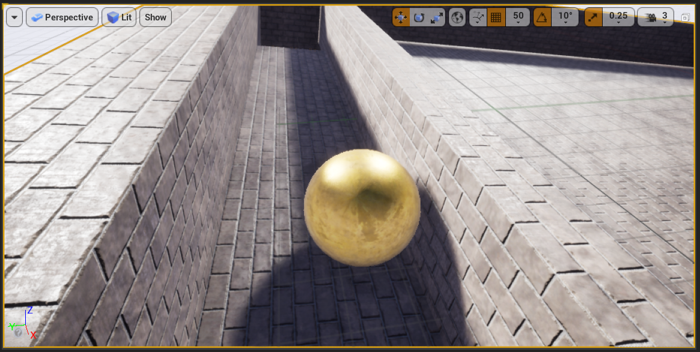

# Udemy - UE4 BP Section 1

My `Awesome Marble Game`.

This UE4 project uses blueprints to allow the player to guide a ball to the goal.

If the ball falls out of the map, the player loses.

If the ball reaches the goal, the player loses.

The level has a custom floor and custom walls.

The level uses box triggers with overlap events to detect when the ball reaches a collider.

Don't move the mouse too fast, or you'll lose.

[Unreal Engine Learn Blueprint Scripting](https://www.udemy.com/course/unrealblueprint/)

**Blueprint - Input**

**Blueprint - Winning and Losing**

**Blueprint - Welcome Message**

**Blueprint - Restart Level**

**Blueprint - Quit**

## Videos

**Udemy UE4 BP Section 1**

